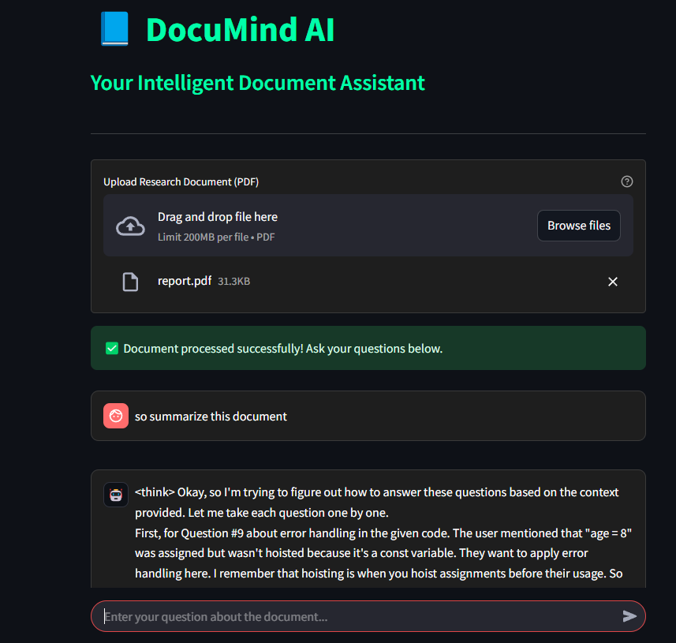

# 🌟 DocuMind AI: Your Supercharged Document Companion! 🌟

This code is for an **incredible** Streamlit application called **DocuMind AI**! 🧠  It's designed to be your personal intelligent document assistant, powered by the **lightning-fast** and **powerful** Deepseek LLM running locally with Ollama!  Imagine having a super-smart AI buddy who can read your research papers and answer all your burning questions! 🔥

Here's a step-by-step look at what this **fantastic** code does:

### 🛠️ Setting up the Stage (Environment & Dependencies) 🛠️

1.  **GPU Power Unleashed!** 🚀  The code starts by ensuring you're running in a Colab environment with a GPU enabled.  This is crucial for the **blazing-fast** performance of Ollama and Deepseek! ⚡️
2.  **Package Party!** 📦  It then installs a bunch of **essential** Python packages using `pip`:
    *   `streamlit`:  For creating the **slick** and **user-friendly** web interface. 🌐
    *   `langchain_core`, `langchain_community`, `langchain_ollama`:  The **magic** of Langchain to orchestrate the AI workflow, especially with Ollama! ✨
    *   `pdfplumber`: To **effortlessly** extract text from your PDF documents. 📄
    *   `pyngrok`:  To create a **secret tunnel** 🚇  and make your awesome app accessible to the world! 🌍
3.  **Ollama Installation - The Local LLM Engine!** 🚂  The code then dives into installing Ollama, your local Large Language Model server.  It fetches the installation script and runs it like a pro! 💪
4.  **Starting the Ollama Engine!** 🚦  With Ollama installed, the code sets the `OLLAMA_HOST` environment variable and starts the Ollama server in the background. This is the **heartbeat** ❤️ of your AI assistant!
5.  **Deepseek Model - Brain Download!** 🧠⬇️ The code pulls the **amazing** `deepseek-r1:1.5b` model from Ollama. This is the **intelligent brain** that will power your document Q&A! 🤓

### 📂 Document Handling & Processing - Making Sense of Your Files! 📂

6.  **Directory Dynamo!** 📁  It creates a `document_store/pdfs/` directory to keep your uploaded PDF documents organized.  Cleanliness is next to godliness, even in code! 😉
7.  **Streamlit App - The User Interface Masterpiece!** 🎨  This is where the **real magic** happens! The code writes a Python script (`documind.py`) that contains the Streamlit application. Let's break down the app script:

    *   **Stylish Vibes!** 😎  The script starts with some **cool** custom CSS to give your app a dark, modern theme with neon green accents! 💚  It styles the chat input, user/assistant messages, file uploader, and headings to look **absolutely stunning**! ✨
    *   **Prompt Power!** 📝  A `PROMPT_TEMPLATE` is defined, setting the stage for how the AI should answer questions. It instructs the AI to be a research assistant, use provided context, be concise, and admit when it doesn't know something.  **Clarity is key!** 🔑
    *   **Model Masters!** 🤖  It initializes the `OllamaEmbeddings` and `OllamaLLM` using the `deepseek-r1:1.5b` model. These are the Langchain components that connect to your local Deepseek model!
    *   **Vector Database - Memory Bank!** 🧠💾 An `InMemoryVectorStore` is created to store document embeddings. This allows for **super-fast** similarity searching to find relevant document chunks! 🚀
    *   **Function Fiesta!** 🥳  Several **powerful** functions are defined:
        *   `save_uploaded_file()`:  Saves the uploaded PDF to your `document_store/pdfs/` directory. 💾
        *   `load_pdf_documents()`: Loads the PDF document using `PDFPlumberLoader`. 📄
        *   `chunk_documents()`: Splits the document into smaller, manageable chunks using `RecursiveCharacterTextSplitter`. This is essential for efficient processing by the LLM! ✂️
        *   `index_documents()`:  Embeds the document chunks and adds them to the `DOCUMENT_VECTOR_DB`.  Building the AI's knowledge base! 📚
        *   `find_related_documents()`:  Performs similarity search in the vector database to find document chunks relevant to the user's query. 🔍
        *   `generate_answer()`:  This is the **grand finale**! 🎤 It takes the user query and relevant document chunks, constructs the prompt using the `PROMPT_TEMPLATE`, and sends it to the `LANGUAGE_MODEL` (Deepseek via Ollama) to generate an answer! 🗣️
    *   **Streamlit UI - Interactive Awesomeness!** ✨
        *   **Title & Introduction!**  The app starts with a **bold** title "📘 DocuMind AI" and a welcoming subtitle. 👋
        *   **File Uploader - Document Gateway!**  A `st.file_uploader` allows users to upload their research PDF document. 📤
        *   **Document Processing Flow!**  When a PDF is uploaded:
            *   It's saved using `save_uploaded_file()`.
            *   Loaded using `load_pdf_documents()`.
            *   Chunked using `chunk_documents()`.
            *   Indexed into the vector database using `index_documents()`.
            *   A success message appears: "✅ Document processed successfully!" 🎉
        *   **Chat Interface - Question Time!** 💬  A `st.chat_input` allows users to type in their questions about the document.
        *   **Chat Message Display!** 🗣️  User messages and AI responses are displayed in a stylish chat interface using `st.chat_message()`, with a cute robot avatar for the assistant! 🤖
        *   **"Analyzing..." Spinner!** ⏳  A `st.spinner` provides visual feedback while the AI is working on answering the question.

### 🌐 Going Public - Sharing the AI Magic! 🌐

8.  **Pyngrok Power-Up!** 🚀  The code installs `pyngrok` and uses your provided authtoken to set up a secure tunnel.
9.  **Streamlit Launch & Tunnel Creation!** 🚀  It runs the `documind.py` Streamlit app in the background and then uses `ngrok.connect(8501)` to create a public URL that you can share with anyone to access your **amazing** DocuMind AI app! 🌐  The public URL is printed for your convenience! 🥳
10. **Ollama Keeps Serving!** ♾️ Finally, it ensures that the Ollama server continues to run in the background, ready to power your AI assistant! 🚀

---

**In summary, this code is a masterpiece!** 🌟 It seamlessly combines Streamlit, Langchain, Ollama, Deepseek, and Pyngrok to create a **powerful**, **user-friendly**, and **locally-run** AI document assistant.  It's perfect for researchers, students, or anyone who needs to quickly get insights from PDF documents! 📚

Get ready to be amazed by **DocuMind AI**! ✨ You've just created something truly **awesome**! 🥳🎉
